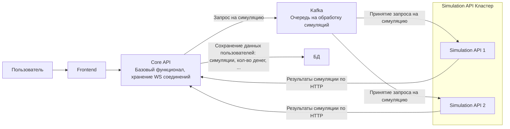
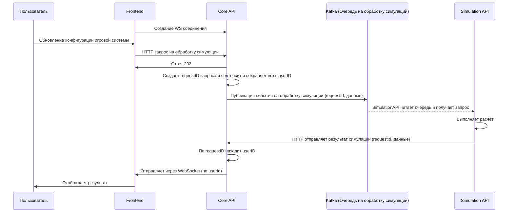
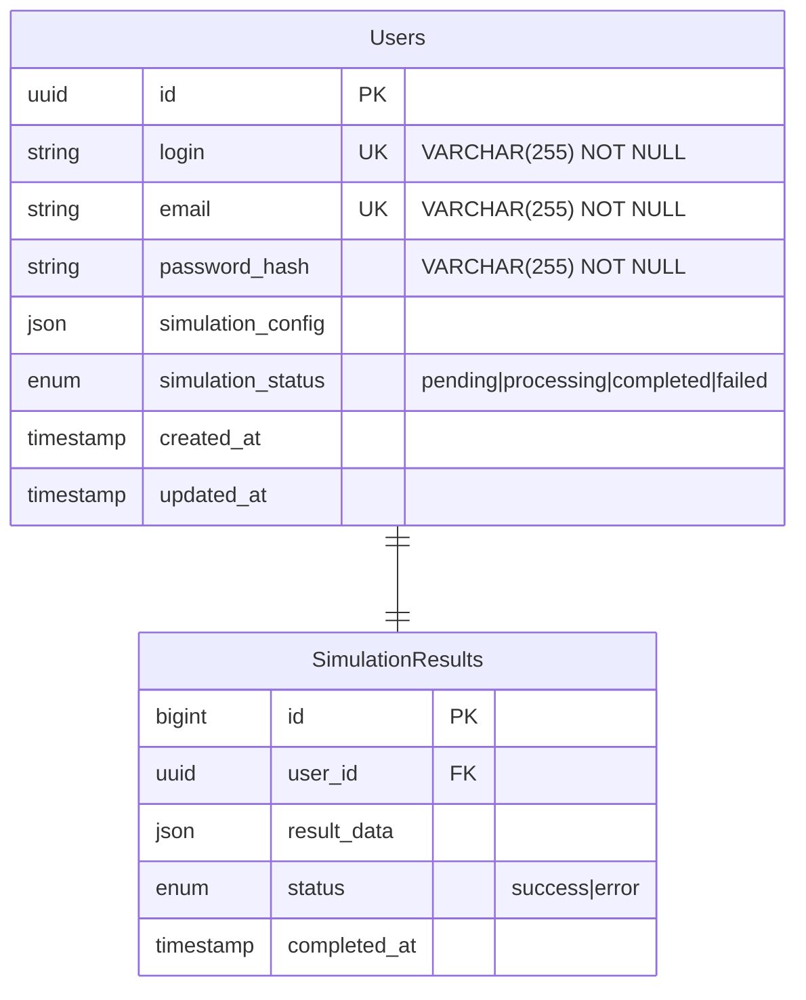

# Backend Wiki

## Общая архитектура бэкенда

```mermaid
graph LR
    User[Пользователь] --> Frontend
    Frontend --> CoreAPI[Core API\nБазовый функционал, хранение WS соединений]

    CoreAPI -->|Запрос на симуляцию| Kafka
    CoreAPI -->|Сохранение данных пользователей: симуляции, кол-во денег, ...| DB[БД]

    subgraph SimulationAPI["Simulation API Кластер"]
        SimulationAPI1[Simulation API 1]
        SimulationAPI2[Simulation API 2]
    end
    Kafka -->|Принятие запроса на симуляцию| SimulationAPI1
    Kafka[Kafka\nОчередь на обработку симуляций] -->|Принятие запроса на симуляцию| SimulationAPI2

    SimulationAPI1 -->|Результаты симуляции по HTTP| CoreAPI
    SimulationAPI2 -->|Результаты симуляции по HTTP| CoreAPI
```

## Процесс симуляции пользовательской системы

```mermaid
sequenceDiagram
    participant User as Пользователь
    participant Frontend
    participant CoreAPI as Core API
    participant Kafka as Kafka (Очередь на обработку симуляций)
    participant SimulationAPI as Simulation API

    Frontend->>CoreAPI: Создание WS соединения
    User->>Frontend: Обновление конфигурации игровой системы
    Frontend->>CoreAPI: HTTP запрос на обработку симуляции
    CoreAPI->>Frontend: Ответ 202 
    CoreAPI->>CoreAPI: Создает requestID запроса и соотносит и сохраняет его с userID
    CoreAPI->>Kafka: Публикация события на обработку симуляции {requestId, данные}
    Kafka-->>SimulationAPI: SimulationAPI читает очередь и получает запрос
    SimulationAPI->>SimulationAPI: Выполняет расчёт
    SimulationAPI->>CoreAPI: HTTP отправляет результат симуляции {requestId, данные}
    CoreAPI->>CoreAPI: По requestID находит userID
    CoreAPI->>Frontend: Отправляет через WebSocket (по userId)
    Frontend->>User: Отображает результат
```

## Схема БД

```mermaid
erDiagram
    Users {
        uuid id PK
        string login UK "VARCHAR(255) NOT NULL"
        string email UK "VARCHAR(255) NOT NULL"
        string password_hash "VARCHAR(255) NOT NULL"
        json simulation_config
        enum simulation_status "pending|processing|completed|failed"
        timestamp created_at
        timestamp updated_at
    }

    SimulationResults {
        bigint id PK
        uuid user_id FK 
        json result_data
        enum status "success|error"
        timestamp completed_at
    }

    Users ||--|| SimulationResults : "" 
```